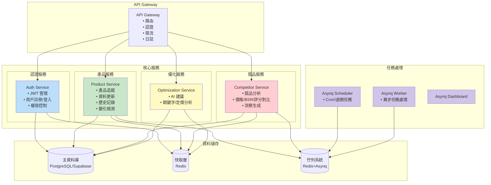
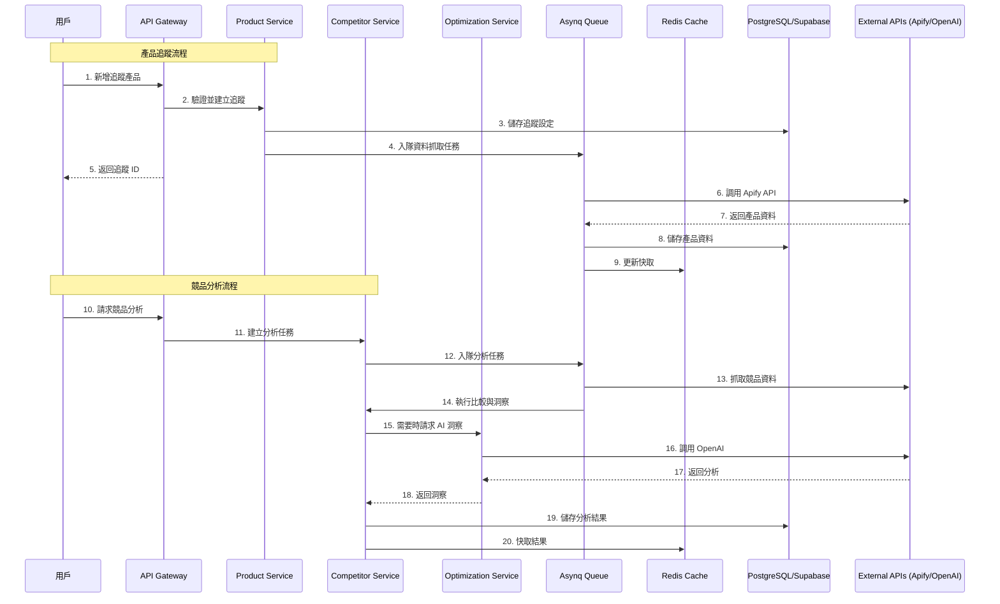
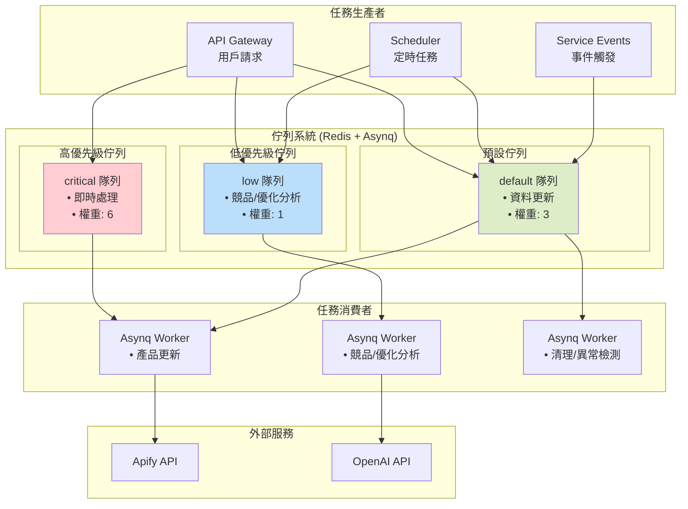
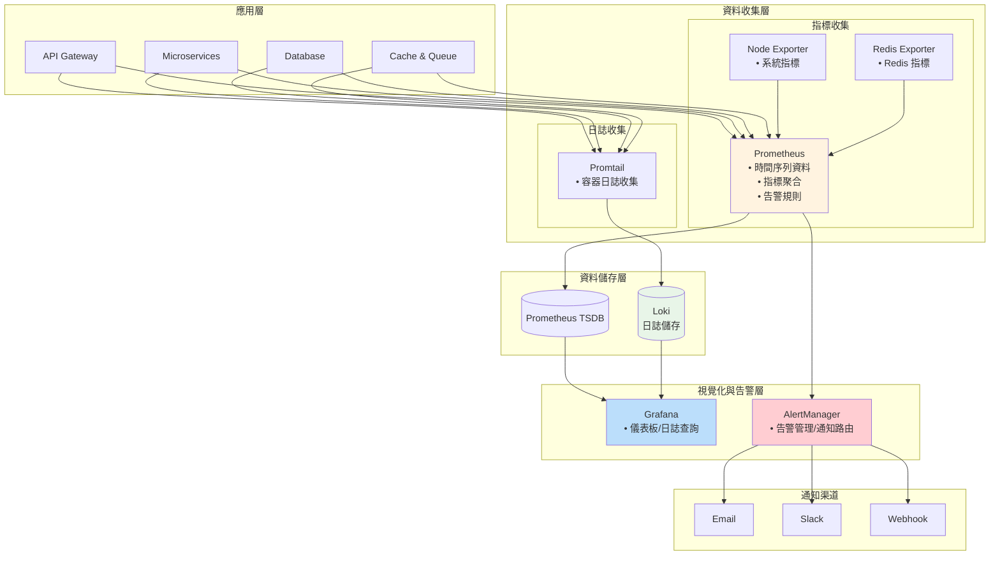
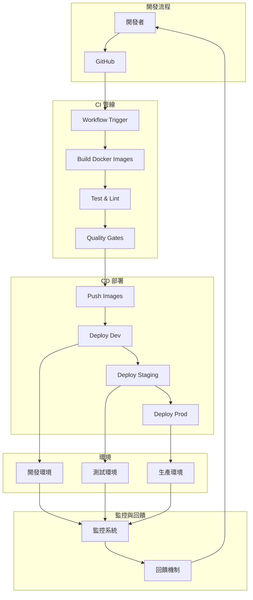
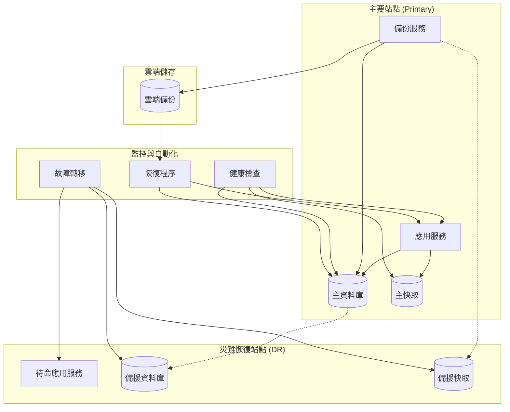

# 系統架構圖文件

## 概述

本文件包含 Amazon 賣家產品監控與優化工具的各種架構圖表，展示系統的整體設計、資料流向和部署拓撲。內容已對齊目前的程式碼與 Docker Compose 部署現狀（單一 API Gateway、Caddy 反向代理、Redis+Asynq 任務、Loki/Promtail 日誌管線，無 K8s/ELK/Jaeger）。

## 1. 系統整體架構圖（與現狀一致）

```mermaid
graph TB
    %% 用戶層
    subgraph "用戶層"
        U1[Amazon 賣家]
        U2[管理員]
    end

    %% 接入層（本地用容器Caddy；生產用物理機Caddy）
    subgraph "接入層"
        CADDY[Caddy 反向代理<br/>/api -> Gateway<br/>/ -> Frontend]
        CDN[CDN<br/>靜態資源]
    end

    %% API 閘道層（單實例）
    subgraph "API 閘道層"
        AG[API Gateway]
    end

    %% 服務層（按實作）
    subgraph "服務層"
        AS[認證服務 Auth]
        PS[產品服務 Product]
        CS[競品服務 Competitor]
        OS[優化服務 Optimization]
        WK[Worker (Asynq)]
        SCH[Scheduler (Asynq)]
        DASH[Asynq Dashboard]
    end

    %% 資料層
    subgraph "資料層"
        DB[(PostgreSQL / Supabase)]
        REDIS[(Redis<br/>快取 & Asynq佇列)]
    end

    %% 外部服務層
    subgraph "外部服務"
        APIFY[Apify API<br/>資料擷取]
        OPENAI[OpenAI API<br/>AI 分析]
    end

    %% 可觀測性
    subgraph "可觀測性"
        PROM[Prometheus]
        GRAF[Grafana]
        LOKI[Loki]
        PT[Promtail]
        NEXP[Node Exporter]
        REXP[Redis Exporter]
    end

    %% 連接關係
    U1 --> CADDY
    U2 --> CADDY
    CADDY --> AG
    CADDY -->|靜態| CDN

    AG --> AS
    AG --> PS
    AG --> CS
    AG --> OS

    AS --> DB
    PS --> DB
    CS --> DB
    OS --> DB

    AS --> REDIS
    PS --> REDIS
    CS --> REDIS
    OS --> REDIS
    SCH --> REDIS
    WK --> REDIS

    PS --> APIFY
    CS --> APIFY
    CS --> OPENAI
    OS --> OPENAI

    AG --> PROM
    AS --> PROM
    PS --> PROM
    CS --> PROM
    OS --> PROM
    WK --> PROM
    SCH --> PROM
    PROM --> GRAF
    PT --> LOKI
    LOKI --> GRAF
    NEXP --> PROM
    REXP --> PROM

    style U1 fill:#e1f5fe
    style U2 fill:#e1f5fe
    style CADDY fill:#fff3e0
    style AG fill:#f3e5f5
    style AS fill:#e8f5e8
    style PS fill:#e8f5e8
    style CS fill:#e8f5e8
    style OS fill:#e8f5e8
    style WK fill:#e8f5e8
    style SCH fill:#e8f5e8
    style DASH fill:#e8f5e8
    style DB fill:#fce4ec
    style REDIS fill:#fce4ec
    style APIFY fill:#fff9c4
    style OPENAI fill:#fff9c4
```

## 2. 微服務架構詳細圖（按 go-zero + Asynq）



## 3. 資料流架構圖（精簡版）



## 4. 部署架構圖（Docker Compose 現狀）

```mermaid
graph TB
    subgraph "單機/VM（Docker Compose）"
        subgraph "網關與前端"
            CADDY[Caddy (本地容器/生產物理機)]
            GATEWAY[amazon-pilot-gateway:8080]
            FRONTEND[amazon-pilot-frontend:3000]
        end

        subgraph "後端服務"
            AUTH[amazon-pilot-auth]
            PRODUCT[amazon-pilot-product]
            COMP[amazon-pilot-competitor]
            OPT[amazon-pilot-optimization]
            WORKER[amazon-pilot-worker]
            SCHED[amazon-pilot-scheduler]
            DASH[amazon-pilot-dashboard]
        end

        subgraph "資料服務"
            POSTGRES[(PostgreSQL 本地容器/連線Supabase)]
            REDIS[(Redis)]
        end

        subgraph "可觀測性"
            PROM[Prometheus]
            GRAF[Grafana]
            LOKI[Loki]
            PT[Promtail]
            NEXP[Node Exporter]
            REXP[Redis Exporter]
        end
    end

    CADDY --> GATEWAY
    CADDY --> FRONTEND
    GATEWAY --> AUTH
    GATEWAY --> PRODUCT
    GATEWAY --> COMP
    GATEWAY --> OPT

    AUTH --> POSTGRES
    PRODUCT --> POSTGRES
    COMP --> POSTGRES
    OPT --> POSTGRES

    AUTH --> REDIS
    PRODUCT --> REDIS
    COMP --> REDIS
    OPT --> REDIS
    WORKER --> REDIS
    SCHED --> REDIS
    DASH --> REDIS

    PRODUCT --> APIFY[(Apify API)]
    COMP --> APIFY
    COMP --> OPENAI[(OpenAI API)]
    OPT --> OPENAI

    GATEWAY --> PROM
    AUTH --> PROM
    PRODUCT --> PROM
    COMP --> PROM
    OPT --> PROM
    WORKER --> PROM
    SCHED --> PROM
    NEXP --> PROM
    REXP --> PROM
    PROM --> GRAF
    PT --> LOKI
    LOKI --> GRAF
```

## 5. 快取與佇列架構圖（Redis + Asynq）



## 7. 安全架構圖（概念一致）

```mermaid
graph TB
    subgraph "外部威脅"
        THREAT1[DDoS 攻擊]
        THREAT2[SQL 注入]
        THREAT3[XSS 攻擊]
        THREAT4[未授權存取]
    end
    
    subgraph "防護層"
        subgraph "網路層防護"
            WAF[Web Application Firewall<br/>• 過濾惡意請求<br/>• Rate Limiting<br/>• IP 黑名單]
            
            CDN[CDN + DDoS Protection<br/>• 分散式防護<br/>• 快取靜態資源<br/>• 地理分散]
        end
        
        subgraph "應用層防護"
            AUTH[Authentication Layer<br/>• JWT Token<br/>• 多因素認證<br/>• 會話管理]
            
            AUTHZ[Authorization Layer<br/>• RBAC 權限控制<br/>• API 權限檢查<br/>• 資源存取控制]
            
            VALID[Input Validation
• 參數驗證
• SQL 注入防護
• XSS 過濾]
        end
        
        subgraph "資料層防護"
            ENCRYPT[Data Encryption<br/>• 傳輸加密 (TLS)<br/>• 靜態加密<br/>• 欄位級加密]
            
            AUDIT[Audit Logging<br/>• 存取日誌<br/>• 操作追蹤<br/>• 異常檢測]
        end
    end
    
    subgraph "核心系統"
        API[API Gateway]
        SERVICES[Microservices]
        DATABASE[(Database)]
    end
    
    subgraph "監控與回應"
        SIEM[安全資訊與事件管理<br/>• 即時監控<br/>• 威脅檢測<br/>• 自動回應]
        
        INCIDENT[事件回應<br/>• 告警通知<br/>• 自動隔離<br/>• 恢復程序]
    end

    %% 威脅到防護
    THREAT1 --> CDN
    THREAT2 --> WAF
    THREAT3 --> VALID
    THREAT4 --> AUTH
    
    %% 防護層級
    CDN --> WAF
    WAF --> API
    
    API --> AUTH
    AUTH --> AUTHZ
    AUTHZ --> VALID
    
    VALID --> SERVICES
    SERVICES --> ENCRYPT
    ENCRYPT --> DATABASE
    
    %% 監控
    API --> AUDIT
    SERVICES --> AUDIT
    DATABASE --> AUDIT
    AUDIT --> SIEM
    SIEM --> INCIDENT
    
    style THREAT1 fill:#ffcdd2
    style THREAT2 fill:#ffcdd2
    style THREAT3 fill:#ffcdd2
    style THREAT4 fill:#ffcdd2
    style WAF fill:#c8e6c9
    style CDN fill:#c8e6c9
    style AUTH fill:#bbdefb
    style AUTHZ fill:#bbdefb
    style VALID fill:#bbdefb
    style ENCRYPT fill:#fff9c4
    style AUDIT fill:#fff9c4
```

## 8. 監控架構圖（Prometheus + Loki/Promtail）



## 9. CI/CD 流程圖（簡要）



## 10. 災難恢復架構圖（概念）



以上圖表已與以下倉庫實際實現對齊：
- Docker Compose 定義：deployments/compose/docker-compose.yml（及 .local/.prod 覆蓋）
- 反向代理：deployments/compose/Caddyfile
- 佇列：internal/pkg/queue/queue.go（Redis + Asynq）
- 監控：Prometheus/Grafana/Loki/Promtail/Exporters（compose/monitoring）
- 服務邏輯：cmd/*、internal/*

