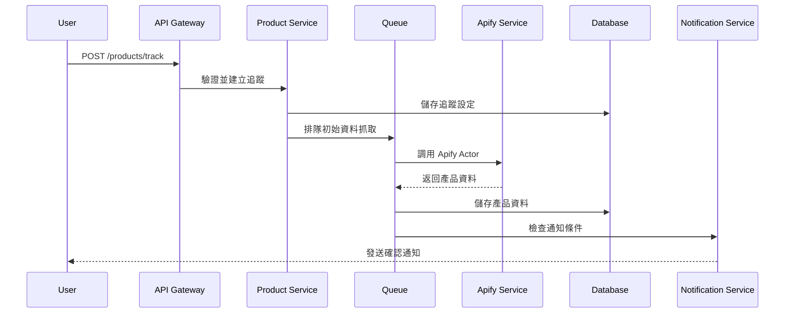
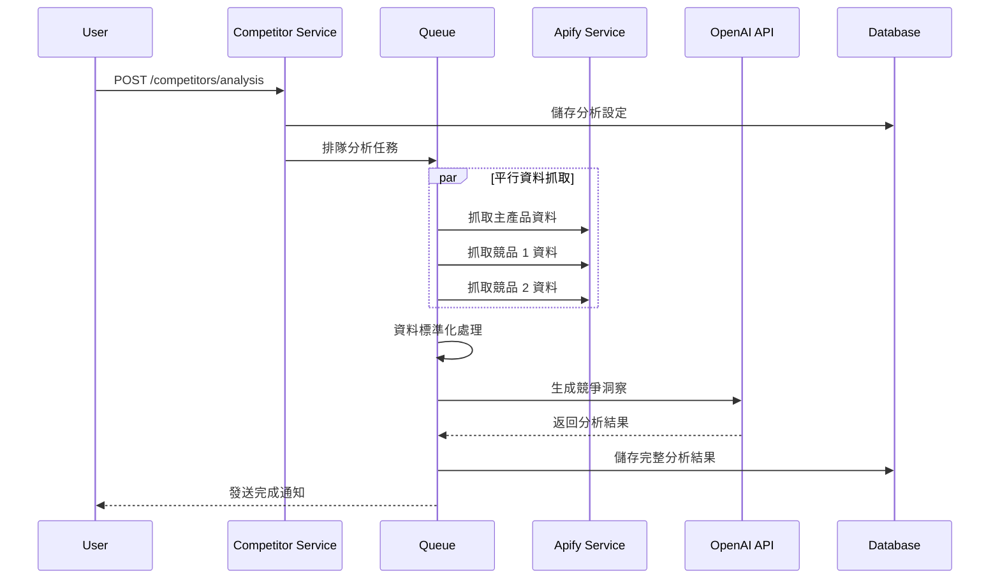

# 系統架構設計文件

## 概述

本文件描述 Amazon 賣家產品監控與優化工具的整體系統架構設計，包含後端服務架構、部署拓撲、資料流向和擴展策略。

## 系統架構概覽

### 設計原則

1. **微服務架構**: 模組化設計，職責明確分離
2. **水平擴展**: 支持服務和資料庫的水平擴展
3. **高可用性**: 消除單點故障，實現故障自動恢復
4. **可觀測性**: 完整的日誌、監控和追踪系統
5. **安全優先**: 多層次安全防護機制

### 核心技術棧

- **後端框架**: Go + goZero
- **ORM**: Gorm
- **資料庫**: Supabase (PostgreSQL) + Redis
- **消息佇列**: Redis + Asynq
- **容器化**: Docker + Docker Compose
- **監控**: Prometheus + Grafana
- **日誌**: ELK Stack (Elasticsearch, Logstash, Kibana)

## 系統架構圖

```
                                    ┌─────────────────┐
                                    │   Load Balancer │
                                    │    (Nginx)      │
                                    └─────────┬───────┘
                                              │
                              ┌───────────────┴───────────────┐
                              │                               │
                    ┌─────────▼─────────┐         ┌─────────▼─────────┐
                    │   API Gateway     │         │   API Gateway     │
                    │   (goZero)        │         │   (goZero)        │
                    └─────────┬─────────┘         └─────────┬─────────┘
                              │                               │
                ┌─────────────┼─────────────┬─────────────────┼─────────────┐
                │             │             │                 │             │
        ┌───────▼──────┐ ┌────▼────┐ ┌─────▼──────┐ ┌───────▼──────┐ ┌────▼─────┐
        │ Auth Service │ │ Product │ │ Competitor │ │ Optimization │ │ Notify   │
        │              │ │ Service │ │ Service    │ │ Service      │ │ Service  │
        └──────────────┘ └─────────┘ └────────────┘ └──────────────┘ └──────────┘
                │             │             │                 │             │
                └─────────────┼─────────────┴─────────────────┼─────────────┘
                              │                               │
                    ┌─────────▼─────────┐         ┌─────────▼─────────┐
                    │     Redis         │         │    Message        │
                    │   (Cache & Queue) │         │    Queue          │
                    └───────────────────┘         │   (Asynq)         │
                                                  └───────────────────┘
                              │
                    ┌─────────▼─────────┐
                    │    Supabase       │
                    │   (PostgreSQL)    │
                    └───────────────────┘
                              │
                    ┌─────────▼─────────┐
                    │   External APIs   │
                    │  Apify | OpenAI   │
                    └───────────────────┘
```

## 微服務架構設計

### 1. API Gateway

**職責**:
- 請求路由和負載均衡
- 統一認證和授權
- Rate limiting 和 API 版本控制
- 請求/回應日誌記錄

**技術實現**:
```go
// goZero + Redis + JWT
package main

import (
    "context"
    "fmt"
    "net/http"
    "time"

    "github.com/zeromicro/go-zero/core/conf"
    "github.com/zeromicro/go-zero/core/logx"
    "github.com/zeromicro/go-zero/core/stores/redis"
    "github.com/zeromicro/go-zero/rest"
    "github.com/zeromicro/go-zero/rest/httpx"
    "github.com/zeromicro/go-zero/rest/handler"
    "github.com/zeromicro/go-zero/rest/middleware"
)

type Config struct {
    rest.RestConf
    Redis redis.RedisConf
    JWT   struct {
        AccessSecret string
        AccessExpire int64
    }
}

type Server struct {
    config Config
    redis  *redis.Redis
}

func main() {
    var c Config
    conf.MustLoad("config.yaml", &c)
    
    server := rest.MustNewServer(c.RestConf)
    defer server.Stop()
    
    // 初始化 Redis
    rds := redis.MustNewRedis(c.Redis)
    
    // 中間件配置
    server.Use(middleware.NewCorsMiddleware().Handle)
    server.Use(handler.NewGunzipHandler().Handle)
    server.Use(rateLimitMiddleware(rds))
    server.Use(authMiddleware())
    
    // 路由配置
    server.AddRoute(rest.Route{
        Method:  http.MethodPost,
        Path:    "/api/auth/login",
        Handler: loginHandler,
    })
    
    server.AddRoute(rest.Route{
        Method:  http.MethodGet,
        Path:    "/api/products",
        Handler: getProductsHandler,
    })
    
    server.AddRoute(rest.Route{
        Method:  http.MethodPost,
        Path:    "/api/products/track",
        Handler: trackProductHandler,
    })
    
    fmt.Printf("Starting server at %s:%d...\n", c.Host, c.Port)
    server.Start()
}

// 限流中間件
func rateLimitMiddleware(rds *redis.Redis) rest.Middleware {
    return func(next http.HandlerFunc) http.HandlerFunc {
        return func(w http.ResponseWriter, r *http.Request) {
            // 根據用戶計劃調整限流
            userPlan := getUserPlanFromContext(r.Context())
            limit := getRateLimit(userPlan)
            
            // 檢查限流
            if !checkRateLimit(rds, r, limit) {
                httpx.WriteJson(w, http.StatusTooManyRequests, map[string]interface{}{
                    "error": map[string]interface{}{
                        "code":    "RATE_LIMIT_EXCEEDED",
                        "message": "Too many requests",
                    },
                })
                return
            }
            
            next(w, r)
        }
    }
}

// 認證中間件
func authMiddleware() rest.Middleware {
    return func(next http.HandlerFunc) http.HandlerFunc {
        return func(w http.ResponseWriter, r *http.Request) {
            // JWT 驗證邏輯
            token := extractToken(r)
            if token == "" {
                httpx.WriteJson(w, http.StatusUnauthorized, map[string]interface{}{
                    "error": map[string]interface{}{
                        "code":    "UNAUTHORIZED",
                        "message": "Missing or invalid token",
                    },
                })
                return
            }
            
            // 驗證 token 並設置用戶信息到 context
            user, err := validateToken(token)
            if err != nil {
                httpx.WriteJson(w, http.StatusUnauthorized, map[string]interface{}{
                    "error": map[string]interface{}{
                        "code":    "UNAUTHORIZED",
                        "message": "Invalid token",
                    },
                })
                return
            }
            
            ctx := context.WithValue(r.Context(), "user", user)
            next(w, r.WithContext(ctx))
        }
    }
}

func getRateLimit(plan string) int {
    limits := map[string]int{
        "basic":     100,
        "premium":   500,
        "enterprise": 2000,
    }
    if limit, ok := limits[plan]; ok {
        return limit
    }
    return 100
}
```

### 2. Authentication Service

**職責**:
- 用戶註冊和登入
- JWT token 生成和驗證
- 權限管理
- 用戶資料管理

**API 端點**:
- `POST /auth/register` - 用戶註冊
- `POST /auth/login` - 用戶登入
- `POST /auth/refresh` - Token 更新
- `GET /auth/profile` - 用戶資料

**資料模型**:
```sql
users: id, email, password_hash, plan_type, created_at
user_sessions: id, user_id, token_hash, expires_at
```

### 3. Product Tracking Service

**職責**:
- 產品資料抓取和更新
- 追蹤設定管理
- 歷史資料儲存
- 變化檢測和通知

**API 端點**:
- `POST /products/track` - 新增追蹤產品
- `GET /products/tracked` - 取得追蹤列表
- `GET /products/{id}/history` - 產品歷史資料
- `DELETE /products/{id}/track` - 停止追蹤

**背景任務**:
```go
// Asynq 任務定義
package tasks

import (
    "context"
    "encoding/json"
    "fmt"
    "time"

    "github.com/hibiken/asynq"
    "github.com/zeromicro/go-zero/core/logx"
    "gorm.io/gorm"
)

type TaskManager struct {
    client *asynq.Client
    server *asynq.Server
    db     *gorm.DB
}

type UpdateProductTask struct {
    ProductID string `json:"product_id"`
}

type BatchUpdateTask struct {
    ProductIDs []string `json:"product_ids"`
}

func NewTaskManager(redisAddr string, db *gorm.DB) *TaskManager {
    client := asynq.NewClient(asynq.RedisClientOpt{Addr: redisAddr})
    server := asynq.NewServer(
        asynq.RedisClientOpt{Addr: redisAddr},
        asynq.Config{
            Concurrency: 10,
            Queues: map[string]int{
                "critical": 6,
                "default":  3,
                "low":      1,
            },
        },
    )

    tm := &TaskManager{
        client: client,
        server: server,
        db:     db,
    }

    // 註冊任務處理器
    tm.registerHandlers()
    return tm
}

func (tm *TaskManager) registerHandlers() {
    // 產品更新任務
    tm.server.HandleFunc("update_product", tm.handleUpdateProduct)
    
    // 批次更新任務
    tm.server.HandleFunc("batch_update_products", tm.handleBatchUpdate)
    
    // 競品分析任務
    tm.server.HandleFunc("competitor_analysis", tm.handleCompetitorAnalysis)
}

func (tm *TaskManager) handleUpdateProduct(ctx context.Context, t *asynq.Task) error {
    var payload UpdateProductTask
    if err := json.Unmarshal(t.Payload(), &payload); err != nil {
        return fmt.Errorf("json.Unmarshal failed: %v: %w", err, asynq.SkipRetry)
    }

    logx.Infof("Processing update product task: %s", payload.ProductID)

    // 1. 調用 Apify API 抓取最新資料
    productData, err := tm.fetchProductData(payload.ProductID)
    if err != nil {
        return fmt.Errorf("fetch product data failed: %v", err)
    }

    // 2. 更新資料庫
    if err := tm.updateProductInDB(payload.ProductID, productData); err != nil {
        return fmt.Errorf("update product in DB failed: %v", err)
    }

    // 3. 檢測變化並發送通知到 Redis 隊列
    if err := tm.checkAndNotify(payload.ProductID, productData); err != nil {
        logx.Errorf("check and notify failed: %v", err)
        // 通知失敗不影響主流程
    }

    logx.Infof("Successfully updated product: %s", payload.ProductID)
    return nil
}

func (tm *TaskManager) handleBatchUpdate(ctx context.Context, t *asynq.Task) error {
    var payload BatchUpdateTask
    if err := json.Unmarshal(t.Payload(), &payload); err != nil {
        return fmt.Errorf("json.Unmarshal failed: %v: %w", err, asynq.SkipRetry)
    }

    logx.Infof("Processing batch update for %d products", len(payload.ProductIDs))

    for _, productID := range payload.ProductIDs {
        // 為每個產品創建單獨的任務
        task, err := NewUpdateProductTask(productID)
        if err != nil {
            logx.Errorf("Failed to create task for product %s: %v", productID, err)
            continue
        }

        // 添加到隊列
        _, err = tm.client.Enqueue(task, asynq.Queue("default"))
        if err != nil {
            logx.Errorf("Failed to enqueue task for product %s: %v", productID, err)
        }
    }

    return nil
}

// 創建產品更新任務
func NewUpdateProductTask(productID string) (*asynq.Task, error) {
    payload := UpdateProductTask{ProductID: productID}
    return asynq.NewTask("update_product", payload)
}

// 創建批次更新任務
func NewBatchUpdateTask(productIDs []string) (*asynq.Task, error) {
    payload := BatchUpdateTask{ProductIDs: productIDs}
    return asynq.NewTask("batch_update_products", payload)
}

// 定期任務調度
func (tm *TaskManager) SchedulePeriodicTasks() {
    scheduler := asynq.NewScheduler(asynq.RedisClientOpt{Addr: "localhost:6379"}, nil)

    // 每日上午 9 點執行產品更新
    _, err := scheduler.Register("@daily 09:00", asynq.NewTask("schedule_daily_updates", nil))
    if err != nil {
        logx.Errorf("Failed to register daily update task: %v", err)
    }

    // 每小時執行高頻產品更新
    _, err = scheduler.Register("@hourly", asynq.NewTask("schedule_hourly_updates", nil))
    if err != nil {
        logx.Errorf("Failed to register hourly update task: %v", err)
    }

    // 週日凌晨 2 點執行競品分析
    _, err = scheduler.Register("0 2 * * 0", asynq.NewTask("schedule_weekly_analysis", nil))
    if err != nil {
        logx.Errorf("Failed to register weekly analysis task: %v", err)
    }

    if err := scheduler.Run(); err != nil {
        logx.Fatalf("Failed to start scheduler: %v", err)
    }
}
```

### 4. Competitor Analysis Service

**職責**:
- 競品群組管理
- 競品資料比較分析
- LLM 驅動的洞察生成
- 分析報告生成

**API 端點**:
- `POST /competitors/analysis` - 建立競品分析
- `GET /competitors/analysis/{id}` - 取得分析結果
- `GET /competitors/analysis/{id}/report` - 取得詳細報告

**分析流程**:
```python
from typing import List, Dict, Any
import asyncio
from celery import current_task

class CompetitorAnalysisService:
    async def create_analysis(self, user_id: str, analysis_config: Dict[str, Any]) -> Dict[str, Any]:
        """建立競品分析"""
        # 1. 驗證和儲存分析設定
        analysis_id = await self.save_analysis_config(user_id, analysis_config)
        
        # 2. 排隊背景分析任務
        task = competitor_analysis_task.delay(analysis_id)
        
        return {"analysis_id": analysis_id, "status": "pending", "task_id": task.id}
    
    @celery_app.task(bind=True)
    def run_analysis(self, analysis_id: str):
        """執行競品分析任務"""
        try:
            # 更新任務狀態
            self.update_state(state='PROGRESS', meta={'current': 0, 'total': 100})
            
            # 1. 平行抓取所有產品資料
            products = asyncio.run(self.fetch_all_products_data(analysis_id))
            self.update_state(state='PROGRESS', meta={'current': 30, 'total': 100})
            
            # 2. 執行比較分析
            comparison = asyncio.run(self.compare_products(products))
            self.update_state(state='PROGRESS', meta={'current': 60, 'total': 100})
            
            # 3. 使用 LLM 生成洞察
            insights = asyncio.run(self.generate_insights(comparison))
            self.update_state(state='PROGRESS', meta={'current': 90, 'total': 100})
            
            # 4. 儲存結果
            asyncio.run(self.save_analysis_result(analysis_id, {
                "comparison": comparison, 
                "insights": insights
            }))
            
            return {"status": "completed", "analysis_id": analysis_id}
            
        except Exception as exc:
            self.update_state(state='FAILURE', meta={'error': str(exc)})
            raise exc
    
    async def fetch_all_products_data(self, analysis_id: str) -> List[Dict[str, Any]]:
        """平行抓取所有產品資料"""
        analysis_config = await self.get_analysis_config(analysis_id)
        product_asins = [analysis_config['main_product_asin']] + analysis_config['competitor_asins']
        
        # 使用 asyncio.gather 平行處理
        tasks = [apify_service.get_product_data(asin) for asin in product_asins]
        products = await asyncio.gather(*tasks, return_exceptions=True)
        
        # 過濾異常結果
        return [p for p in products if not isinstance(p, Exception)]
```

### 5. Optimization Service

**職責**:
- Listing 優化分析
- OpenAI API 整合
- 優化建議生成
- A/B 測試追蹤

**API 端點**:
- `POST /optimization/analyze` - 開始優化分析
- `GET /optimization/{id}` - 取得優化建議
- `POST /optimization/{id}/implement` - 標記建議實施

**LLM 整合**:
```python
from openai import AsyncOpenAI
from typing import Dict, Any
import json

class OptimizationService:
    def __init__(self):
        self.openai_client = AsyncOpenAI(api_key=settings.OPENAI_API_KEY)
    
    async def generate_suggestions(self, product_data: Dict[str, Any]) -> Dict[str, Any]:
        """使用 OpenAI API 生成優化建議"""
        prompt = f"""
        分析以下 Amazon 產品資料並提供優化建議:
        
        產品標題: {product_data.get('title', '')}
        當前價格: {product_data.get('price', 0)}
        BSR 排名: {product_data.get('bsr', 0)}
        評分: {product_data.get('rating', 0)}
        競品價格範圍: {product_data.get('competitor_price_range', '')}
        
        請提供以下方面的具體優化建議:
        1. 標題優化 (包含高搜尋量關鍵字)
        2. 定價策略
        3. 產品描述改進
        4. 圖片建議
        
        回應格式為 JSON，包含以下結構:
        {{
            "title_optimization": {{
                "current": "現在標題",
                "suggested": "建議標題",
                "reasoning": "原因說明",
                "impact_score": 85
            }},
            "pricing_strategy": {{
                "current": 299.99,
                "suggested": 279.99,
                "reasoning": "定價建議原因",
                "impact_score": 70
            }},
            "feature_improvements": [
                {{
                    "area": "產品描述",
                    "suggestion": "具體建議",
                    "priority": "high"
                }}
            ]
        }}
        """
        
        try:
            response = await self.openai_client.chat.completions.create(
                model="gpt-4",
                messages=[
                    {
                        "role": "system",
                        "content": "你是一個專業的 Amazon 電商優化顧問，擅長分析產品資料並提供具體的優化建議。"
                    },
                    {
                        "role": "user",
                        "content": prompt
                    }
                ],
                temperature=0.7,
                max_tokens=2000,
                response_format={"type": "json_object"}
            )
            
            return json.loads(response.choices[0].message.content)
            
        except Exception as e:
            logger.error(f"OpenAI API 錯誤: {str(e)}")
            raise Exception("無法生成優化建議")
    
    @celery_app.task
    def generate_optimization_analysis(self, product_id: str, analysis_type: str = "comprehensive"):
        """背景任務：生成優化分析"""
        try:
            # 獲取產品資料
            product_data = asyncio.run(self.get_product_data(product_id))
            
            # 獲取競品資料
            competitor_data = asyncio.run(self.get_competitor_data(product_id))
            
            # 生成優化建議
            suggestions = asyncio.run(self.generate_suggestions({
                **product_data,
                "competitor_price_range": competitor_data.get("price_range")
            }))
            
            # 儲存結果
            asyncio.run(self.save_optimization_result(product_id, suggestions))
            
            return {"status": "completed", "product_id": product_id}
            
        except Exception as exc:
            logger.error(f"優化分析失敗: {str(exc)}")
            raise exc
```

### 6. Notification Service

**職責**:
- 實時通知管理
- 多渠道通知發送 (Email, Push, Webhook)
- 通知模板管理
- 通知歷史記錄

**通知類型**:
- 價格變化警告
- BSR 排名變化
- 分析完成通知
- 系統維護通知

## 資料流向設計

### 1. 產品追蹤資料流



### 2. 競品分析資料流



## 快取與佇列設計

### 1. Redis 快取架構

**快取層級**:
```redis
# L1 Cache - 熱門產品基本資料 (TTL: 24h)
product:basic:{asin} -> JSON

# L2 Cache - 產品歷史資料 (TTL: 1h)
product:history:{product_id}:{metric}:{period} -> JSON Array

# L3 Cache - 用戶相關資料 (TTL: 30min)
user:tracked:{user_id} -> JSON Array
user:notifications:{user_id} -> JSON Array

# Session Cache - 用戶會話 (TTL: 7d)
session:{token_hash} -> JSON

# Rate Limiting - API 限流 (TTL: 1min)
rate_limit:{user_id}:{endpoint} -> Counter
```

**快取策略**:
```javascript
class CacheService {
  async get(key) {
    const cached = await redis.get(key);
    return cached ? JSON.parse(cached) : null;
  }
  
  async set(key, value, ttl = 3600) {
    await redis.setex(key, ttl, JSON.stringify(value));
  }
  
  async invalidate(pattern) {
    const keys = await redis.keys(pattern);
    if (keys.length > 0) {
      await redis.del(...keys);
    }
  }
  
  // 快取穿透保護
  async getWithFallback(key, fallbackFn, ttl = 3600) {
    let data = await this.get(key);
    
    if (!data) {
      data = await fallbackFn();
      if (data) {
        await this.set(key, data, ttl);
      }
    }
    
    return data;
  }
}
```

### 2. 任務佇列設計

**佇列類型**:
```javascript
// 產品更新佇列 - 高優先級
const productQueue = new Queue('product-updates', {
  defaultJobOptions: {
    removeOnComplete: 10,
    removeOnFail: 5,
    delay: 0,
    attempts: 3,
    backoff: {
      type: 'exponential',
      delay: 2000,
    }
  }
});

// 分析佇列 - 中優先級
const analysisQueue = new Queue('analysis', {
  defaultJobOptions: {
    removeOnComplete: 5,
    removeOnFail: 3,
    attempts: 2,
    backoff: {
      type: 'fixed',
      delay: 5000,
    }
  }
});

// 通知佇列 - 低優先級
const notificationQueue = new Queue('notifications', {
  defaultJobOptions: {
    removeOnComplete: 20,
    removeOnFail: 10,
    attempts: 5,
    delay: 1000,
  }
});
```

**任務調度**:
```javascript
// 定期任務調度
cron.schedule('0 */6 * * *', () => {
  // 每 6 小時更新高頻產品
  scheduleHighFrequencyUpdates();
});

cron.schedule('0 9 * * *', () => {
  // 每日上午 9 點更新所有產品
  scheduleDailyUpdates();
});

cron.schedule('0 2 * * 0', () => {
  // 每週日凌晨 2 點執行競品分析
  scheduleWeeklyAnalysis();
});
```

## 部署架構

### 1. Docker 容器化

**Dockerfile 範例**:
```dockerfile
# Go 微服務
FROM golang:1.21-alpine AS builder

# 設定工作目錄
WORKDIR /app

# 安裝必要的工具
RUN apk add --no-cache git ca-certificates tzdata

# 複製 go mod 文件
COPY go.mod go.sum ./

# 下載依賴
RUN go mod download

# 複製源碼
COPY . .

# 編譯應用
RUN CGO_ENABLED=0 GOOS=linux go build -a -installsuffix cgo -o main .

# 運行階段
FROM alpine:latest

# 安裝 ca-certificates 和 curl
RUN apk --no-cache add ca-certificates curl

# 設定時區
RUN apk add --no-cache tzdata
ENV TZ=Asia/Taipei

# 建立非 root 用戶
RUN adduser -D -s /bin/sh appuser

# 從 builder 階段複製二進制文件
COPY --from=builder /app/main /app/main
COPY --from=builder /app/etc /app/etc

# 設定權限
RUN chown -R appuser:appuser /app
USER appuser

# 暴露端口
EXPOSE 8080

# 健康檢查
HEALTHCHECK --interval=30s --timeout=3s --start-period=5s --retries=3 \
  CMD curl -f http://localhost:8080/health || exit 1

# 啟動應用
CMD ["/app/main", "-f", "/app/etc/config.yaml"]
```

**Docker Compose 設定**:
```yaml
version: '3.8'

services:
  # API Gateway
  api-gateway:
    build: ./api-gateway
    ports:
      - "8080:8080"
    environment:
      - ENVIRONMENT=production
      - REDIS_URL=redis://redis:6379
      - DATABASE_URL=${SUPABASE_URL}
    depends_on:
      - redis
      - asynq-worker
    restart: unless-stopped

  # Asynq Worker
  asynq-worker:
    build: ./api-gateway
    command: ["./main", "worker"]
    environment:
      - DATABASE_URL=${SUPABASE_URL}
      - REDIS_URL=redis://redis:6379
      - APIFY_TOKEN=${APIFY_TOKEN}
      - OPENAI_API_KEY=${OPENAI_API_KEY}
    depends_on:
      - redis
    restart: unless-stopped

  # Asynq Scheduler (定時任務調度器)
  asynq-scheduler:
    build: ./api-gateway
    command: ["./main", "scheduler"]
    environment:
      - DATABASE_URL=${SUPABASE_URL}
      - REDIS_URL=redis://redis:6379
    depends_on:
      - redis
    restart: unless-stopped

  # Asynq Monitor (監控界面)
  asynq-monitor:
    build: ./api-gateway
    command: ["./main", "monitor"]
    ports:
      - "5555:5555"
    environment:
      - REDIS_URL=redis://redis:6379
    depends_on:
      - redis
    restart: unless-stopped

  # Redis 快取和佇列
  redis:
    image: redis:7-alpine
    ports:
      - "6379:6379"
    volumes:
      - redis_data:/data
    command: redis-server --appendonly yes
    restart: unless-stopped

  # 監控服務
  prometheus:
    image: prom/prometheus
    ports:
      - "9090:9090"
    volumes:
      - ./monitoring/prometheus.yml:/etc/prometheus/prometheus.yml
      - prometheus_data:/prometheus
    restart: unless-stopped

  grafana:
    image: grafana/grafana
    ports:
      - "3000:3000"
    volumes:
      - grafana_data:/var/lib/grafana
      - ./monitoring/grafana:/etc/grafana/provisioning
    environment:
      - GF_SECURITY_ADMIN_PASSWORD=${GRAFANA_PASSWORD}
    restart: unless-stopped

volumes:
  redis_data:
  prometheus_data:
  grafana_data:
```

### 2. 水平擴展策略

**負載均衡配置**:
```nginx
upstream api_gateway {
    least_conn;
    server api-gateway-1:3000;
    server api-gateway-2:3000;
    server api-gateway-3:3000;
}

upstream product_service {
    least_conn;
    server product-service-1:3000;
    server product-service-2:3000;
}

server {
    listen 80;
    server_name api.amazon-monitor.com;

    location / {
        proxy_pass http://api_gateway;
        proxy_set_header Host $host;
        proxy_set_header X-Real-IP $remote_addr;
        proxy_set_header X-Forwarded-For $proxy_add_x_forwarded_for;
        proxy_set_header X-Forwarded-Proto $scheme;
        
        # 連接超時設定
        proxy_connect_timeout 5s;
        proxy_send_timeout 10s;
        proxy_read_timeout 10s;
    }
}
```

**自動擴展**:
```yaml
# Kubernetes HPA 範例
apiVersion: autoscaling/v2
kind: HorizontalPodAutoscaler
metadata:
  name: product-service-hpa
spec:
  scaleTargetRef:
    apiVersion: apps/v1
    kind: Deployment
    name: product-service
  minReplicas: 2
  maxReplicas: 10
  metrics:
  - type: Resource
    resource:
      name: cpu
      target:
        type: Utilization
        averageUtilization: 70
  - type: Resource
    resource:
      name: memory
      target:
        type: Utilization
        averageUtilization: 80
```

## 監控與維運設計

### 1. 監控指標

**系統指標**:
- CPU 使用率
- 記憶體使用率
- 磁碟 I/O
- 網路流量

**應用指標**:
- API 回應時間
- 錯誤率
- 請求吞吐量
- 佇列長度

**業務指標**:
- 產品追蹤數量
- 分析完成率
- 用戶活躍度
- API 使用量

**Prometheus 設定**:
```yaml
# prometheus.yml
global:
  scrape_interval: 15s

scrape_configs:
  - job_name: 'api-gateway'
    static_configs:
      - targets: ['api-gateway:3000']
    metrics_path: '/metrics'
    scrape_interval: 5s

  - job_name: 'product-service'
    static_configs:
      - targets: ['product-service:3000']
    metrics_path: '/metrics'

  - job_name: 'redis'
    static_configs:
      - targets: ['redis:6379']

rule_files:
  - "alert_rules.yml"

alerting:
  alertmanagers:
    - static_configs:
        - targets:
          - alertmanager:9093
```

### 2. 日誌架構

**結構化日誌格式**:
```python
import logging
import json
from datetime import datetime
from typing import Dict, Any

# 設定結構化日誌
class JSONFormatter(logging.Formatter):
    def format(self, record):
        log_entry = {
            'timestamp': datetime.utcnow().isoformat(),
            'level': record.levelname,
            'service': 'amazon-monitor',
            'version': os.getenv('APP_VERSION', '1.0.0'),
            'message': record.getMessage(),
            'module': record.module,
            'function': record.funcName,
            'line': record.lineno
        }
        
        # 添加額外的上下文信息
        if hasattr(record, 'extra_data'):
            log_entry.update(record.extra_data)
            
        if record.exc_info:
            log_entry['exception'] = self.formatException(record.exc_info)
            
        return json.dumps(log_entry, ensure_ascii=False)

# 配置日誌
def setup_logging():
    logger = logging.getLogger('amazon_monitor')
    logger.setLevel(logging.INFO)
    
    # 文件處理器
    file_handler = logging.FileHandler('logs/application.log')
    file_handler.setFormatter(JSONFormatter())
    
    # 錯誤文件處理器
    error_handler = logging.FileHandler('logs/error.log')
    error_handler.setLevel(logging.ERROR)
    error_handler.setFormatter(JSONFormatter())
    
    # 控制台處理器
    console_handler = logging.StreamHandler()
    console_handler.setFormatter(JSONFormatter())
    
    logger.addHandler(file_handler)
    logger.addHandler(error_handler)
    logger.addHandler(console_handler)
    
    return logger

# 業務日誌記錄器
class BusinessLogger:
    @staticmethod
    def product_updated(product_id: str, changes: list, user_id: str):
        logger.info('Product updated', extra={
            'extra_data': {
                'event': 'product_updated',
                'product_id': product_id,
                'changes': changes,
                'user_id': user_id
            }
        })
    
    @staticmethod
    def analysis_completed(analysis_id: str, duration: float, status: str):
        logger.info('Analysis completed', extra={
            'extra_data': {
                'event': 'analysis_completed',
                'analysis_id': analysis_id,
                'duration': duration,
                'status': status
            }
        })
```

### 3. 錯誤追蹤與告警

**告警規則**:
```yaml
# alert_rules.yml
groups:
- name: api_alerts
  rules:
  - alert: HighErrorRate
    expr: rate(http_requests_total{status=~"5.."}[5m]) > 0.1
    for: 5m
    labels:
      severity: warning
    annotations:
      summary: "High error rate detected"
      
  - alert: HighResponseTime
    expr: histogram_quantile(0.95, rate(http_request_duration_seconds_bucket[5m])) > 1
    for: 2m
    labels:
      severity: critical
    annotations:
      summary: "High response time detected"

- name: queue_alerts
  rules:
  - alert: QueueTooLong
    expr: bull_queue_waiting_jobs > 1000
    for: 5m
    labels:
      severity: warning
    annotations:
      summary: "Queue length is too high"
```

## 安全性架構

### 1. API 安全

**認證與授權**:
```javascript
// JWT 中間件
const jwt = require('jsonwebtoken');

function authenticateToken(req, res, next) {
  const authHeader = req.headers['authorization'];
  const token = authHeader && authHeader.split(' ')[1];

  if (!token) {
    return res.sendStatus(401);
  }

  jwt.verify(token, process.env.JWT_SECRET, (err, user) => {
    if (err) return res.sendStatus(403);
    req.user = user;
    next();
  });
}

// Rate limiting per user
const userRateLimit = rateLimit({
  windowMs: 60 * 1000,
  max: (req) => {
    // 根據用戶計劃調整限流
    switch (req.user?.plan_type) {
      case 'enterprise': return 2000;
      case 'premium': return 500;
      default: return 100;
    }
  },
  keyGenerator: (req) => req.user?.id || req.ip
});
```

### 2. 資料安全

**敏感資料加密**:
```javascript
const crypto = require('crypto');

class EncryptionService {
  constructor() {
    this.algorithm = 'aes-256-gcm';
    this.secretKey = Buffer.from(process.env.ENCRYPTION_KEY, 'hex');
  }

  encrypt(text) {
    const iv = crypto.randomBytes(16);
    const cipher = crypto.createCipher(this.algorithm, this.secretKey);
    cipher.setAAD(Buffer.from('amazon-monitor', 'utf8'));
    
    let encrypted = cipher.update(text, 'utf8', 'hex');
    encrypted += cipher.final('hex');
    
    const authTag = cipher.getAuthTag();
    
    return {
      iv: iv.toString('hex'),
      encryptedData: encrypted,
      authTag: authTag.toString('hex')
    };
  }

  decrypt(encryptedObj) {
    const decipher = crypto.createDecipher(this.algorithm, this.secretKey);
    decipher.setAAD(Buffer.from('amazon-monitor', 'utf8'));
    decipher.setAuthTag(Buffer.from(encryptedObj.authTag, 'hex'));
    
    let decrypted = decipher.update(encryptedObj.encryptedData, 'hex', 'utf8');
    decrypted += decipher.final('utf8');
    
    return decrypted;
  }
}
```

### 3. 網路安全

**HTTPS 和安全標頭**:
```javascript
const helmet = require('helmet');

app.use(helmet({
  contentSecurityPolicy: {
    directives: {
      defaultSrc: ["'self'"],
      scriptSrc: ["'self'", "'unsafe-inline'"],
      styleSrc: ["'self'", "'unsafe-inline'"],
      imgSrc: ["'self'", "data:", "https:"]
    }
  },
  hsts: {
    maxAge: 31536000,
    includeSubDomains: true,
    preload: true
  }
}));

// CORS 設定
app.use(cors({
  origin: process.env.ALLOWED_ORIGINS?.split(',') || 'http://localhost:3000',
  credentials: true,
  optionsSuccessStatus: 200
}));
```

## 效能優化策略

### 1. 資料庫優化

**連接池設定**:
```javascript
const { Pool } = require('pg');

const pool = new Pool({
  host: process.env.DB_HOST,
  port: process.env.DB_PORT,
  database: process.env.DB_NAME,
  user: process.env.DB_USER,
  password: process.env.DB_PASSWORD,
  max: 20, // 最大連接數
  idleTimeoutMillis: 30000,
  connectionTimeoutMillis: 2000,
});
```

**查詢優化**:
```javascript
class ProductRepository {
  async getTrackedProducts(userId, pagination) {
    const query = `
      SELECT p.*, tp.alias, tp.tracking_frequency,
             ph.price as current_price,
             rh.bsr_rank, rh.rating
      FROM tracked_products tp
      JOIN products p ON tp.product_id = p.id
      LEFT JOIN LATERAL (
        SELECT price FROM product_price_history 
        WHERE product_id = p.id 
        ORDER BY recorded_at DESC LIMIT 1
      ) ph ON true
      LEFT JOIN LATERAL (
        SELECT bsr_rank, rating FROM product_ranking_history 
        WHERE product_id = p.id 
        ORDER BY recorded_at DESC LIMIT 1
      ) rh ON true
      WHERE tp.user_id = $1 AND tp.is_active = true
      ORDER BY tp.updated_at DESC
      LIMIT $2 OFFSET $3
    `;
    
    return await pool.query(query, [userId, pagination.limit, pagination.offset]);
  }
}
```

### 2. 快取優化

**多層快取策略**:
```javascript
class CacheManager {
  constructor() {
    this.l1Cache = new Map(); // 記憶體快取
    this.l2Cache = redis; // Redis 快取
  }

  async get(key) {
    // L1 快取檢查
    if (this.l1Cache.has(key)) {
      return this.l1Cache.get(key);
    }

    // L2 快取檢查
    const cached = await this.l2Cache.get(key);
    if (cached) {
      const data = JSON.parse(cached);
      this.l1Cache.set(key, data); // 回填 L1
      return data;
    }

    return null;
  }

  async set(key, value, ttl = 3600) {
    // 同時設定兩層快取
    this.l1Cache.set(key, value);
    await this.l2Cache.setex(key, ttl, JSON.stringify(value));
  }
}
```

## 災難恢復計畫

### 1. 備份策略

**資料庫備份**:
```bash
#!/bin/bash
# 每日備份腳本

DATE=$(date +%Y%m%d_%H%M%S)
BACKUP_DIR="/backup/postgres"

# 建立完整備份
pg_dump -h $DB_HOST -U $DB_USER -d $DB_NAME > $BACKUP_DIR/full_backup_$DATE.sql

# 保留最近 30 天的備份
find $BACKUP_DIR -name "full_backup_*.sql" -type f -mtime +30 -delete

# 上傳到雲端儲存
aws s3 cp $BACKUP_DIR/full_backup_$DATE.sql s3://backup-bucket/postgres/
```

### 2. 故障恢復

**服務健康檢查**:
```python
from fastapi import FastAPI, HTTPException
from fastapi.responses import JSONResponse
import asyncio
import asyncpg
import redis.asyncio as redis
from datetime import datetime

app = FastAPI()

@app.get("/health")
async def health_check():
    """健康檢查端點"""
    health = {
        "status": "healthy",
        "timestamp": datetime.utcnow().isoformat(),
        "services": {}
    }

    try:
        # 檢查資料庫連接
        conn = await asyncpg.connect(DATABASE_URL)
        await conn.execute('SELECT 1')
        await conn.close()
        health["services"]["database"] = "healthy"
    except Exception as error:
        health["services"]["database"] = "unhealthy"
        health["status"] = "unhealthy"
        health["database_error"] = str(error)

    try:
        # 檢查 Redis 連接
        redis_client = redis.Redis.from_url(REDIS_URL)
        await redis_client.ping()
        await redis_client.close()
        health["services"]["redis"] = "healthy"
    except Exception as error:
        health["services"]["redis"] = "unhealthy"
        health["status"] = "unhealthy"
        health["redis_error"] = str(error)

    # 檢查 Celery 連接
    try:
        from celery import current_app
        inspect = current_app.control.inspect()
        stats = inspect.stats()
        if stats:
            health["services"]["celery"] = "healthy"
        else:
            health["services"]["celery"] = "unhealthy"
            health["status"] = "unhealthy"
    except Exception as error:
        health["services"]["celery"] = "unhealthy"
        health["status"] = "unhealthy"
        health["celery_error"] = str(error)

    status_code = 200 if health["status"] == "healthy" else 503
    return JSONResponse(content=health, status_code=status_code)

@app.get("/health/ready")
async def readiness_check():
    """就緒檢查端點"""
    # 檢查關鍵服務是否就緒
    try:
        conn = await asyncpg.connect(DATABASE_URL)
        await conn.execute('SELECT 1')
        await conn.close()
        
        redis_client = redis.Redis.from_url(REDIS_URL)
        await redis_client.ping()
        await redis_client.close()
        
        return {"status": "ready"}
    except Exception as error:
        raise HTTPException(status_code=503, detail=f"Service not ready: {str(error)}")

@app.get("/health/live")
async def liveness_check():
    """存活檢查端點"""
    return {"status": "alive", "timestamp": datetime.utcnow().isoformat()}
```

**自動重啟機制**:
```yaml
# Docker Compose 重啟策略
restart_policy:
  condition: on-failure
  delay: 5s
  max_attempts: 3
  window: 120s
```

## 擴展性規劃

### 1. 水平擴展

**微服務擴展**:
- 各服務可獨立擴展
- 使用容器編排（Kubernetes）
- 自動擴展基於 CPU/記憶體使用率

**資料庫擴展**:
- 讀寫分離
- 資料分片（依用戶或時間）
- 連接池優化

### 2. 垂直擴展

**效能瓶頸識別**:
- APM 工具監控
- 資料庫查詢分析
- 記憶體使用優化

**資源升級策略**:
- CPU 密集型服務：增加 CPU 核心
- I/O 密集型服務：使用 SSD 儲存
- 記憶體密集型服務：增加 RAM

這個架構設計提供了完整的可擴展性、高可用性和維護性，能夠支持大規模的 Amazon 產品監控和分析需求。
