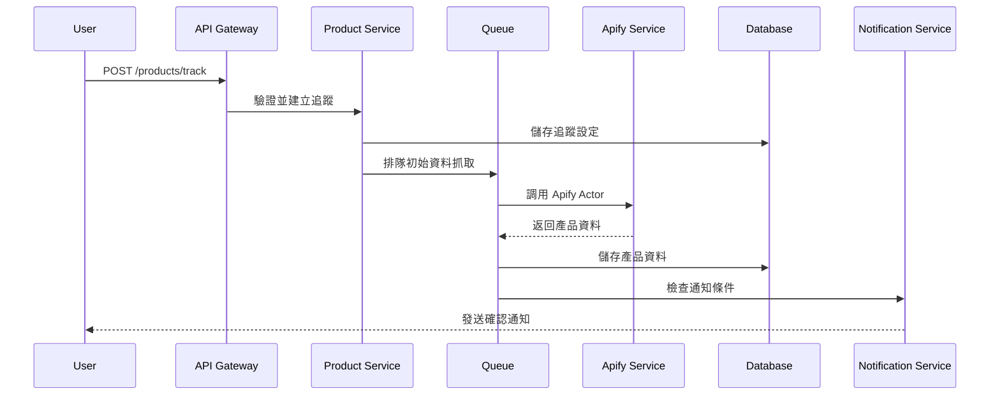
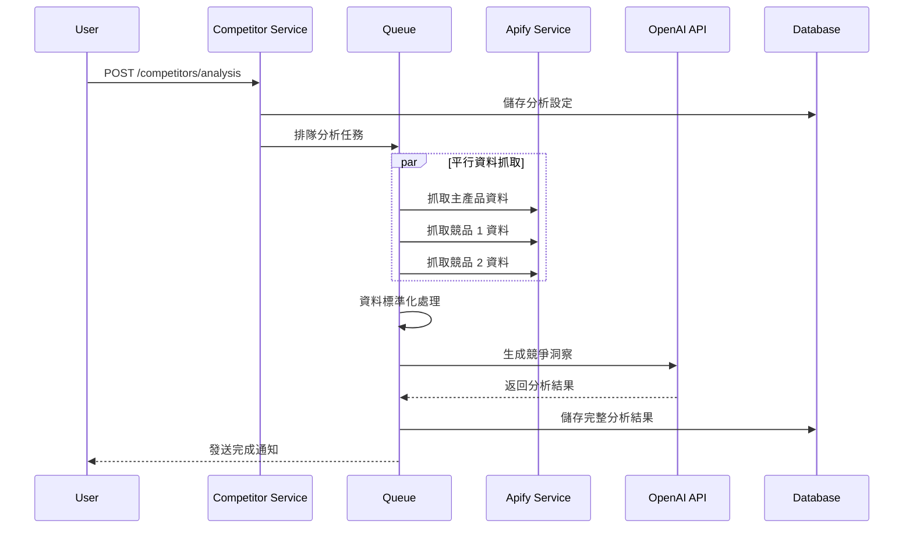

# 系統架構設計文件

## 概述

本文件描述 Amazon 賣家產品監控與優化工具的整體系統架構設計，包含後端服務架構、部署拓撲、資料流向和擴展策略。

**实现的核心功能**：
- ✅ **产品资料追踪系统** (questions.md 选项1) - 完整实现
- ✅ **竞品分析引擎** (questions.md 选项2) - 完整实现，包含LLM报告生成

**当前系统状态**：全功能企业级Amazon产品监控平台，支持异常检测、竞品分析和LLM驱动的市场洞察。

## 系統架構概覽

### 設計原則

1. **微服務架構**: 模組化設計，職責明確分離
2. **水平擴展**: 支持服務和資料庫的水平擴展
3. **高可用性**: 消除單點故障，實現故障自動恢復
4. **可觀測性**: 完整的日誌、監控和追踪系統
5. **安全優先**: 多層次安全防護機制

### 核心技術棧

- **後端框架**: Go + go-zero微服务架构
- **ORM**: Gorm v2 + 自定义JSON结构化日志
- **資料庫**: PostgreSQL + Redis (缓存层)
- **消息佇列**: Redis + Asynq (异步任务处理)
- **LLM集成**: DeepSeek API (竞争定位报告生成)
- **数据源**: Apify API (Amazon产品数据爬取)
- **前端**: Next.js + React + TypeScript + Tailwind CSS
- **API网关**: 统一路由和认证
- **监控**: 结构化JSON日志 + 业务操作追踪
- **部署**: 服务管理脚本 + Docker支持

## 系統架構圖

```
                                    ┌─────────────────┐
                                    │   Load Balancer │
                                    │    (Nginx)      │
                                    └─────────┬───────┘
                                              │
                              ┌───────────────┴───────────────┐
                              │                               │
                    ┌─────────▼─────────┐         ┌─────────▼─────────┐
                    │   API Gateway     │         │   API Gateway     │
                    │   (goZero)        │         │   (goZero)        │
                    └─────────┬─────────┘         └─────────┬─────────┘
                              │                               │
                ┌─────────────┼─────────────┬─────────────────┼─────────────┐
                │             │             │                 │             │
        ┌───────▼──────┐ ┌────▼────┐ ┌─────▼──────┐ ┌───────▼──────┐ ┌────▼─────┐
        │ Auth Service │ │ Product │ │ Competitor │ │ Optimization │ │ Notify   │
        │              │ │ Service │ │ Service    │ │ Service      │ │ Service  │
        └──────────────┘ └─────────┘ └────────────┘ └──────────────┘ └──────────┘
                │             │             │                 │             │
                └─────────────┼─────────────┴─────────────────┼─────────────┘
                              │                               │
                    ┌─────────▼─────────┐         ┌─────────▼─────────┐
                    │     Redis         │         │    Message        │
                    │   (Cache & Queue) │         │    Queue          │
                    └───────────────────┘         │   (Asynq)         │
                                                  └───────────────────┘
                              │
                    ┌─────────▼─────────┐
                    │    Supabase       │
                    │   (PostgreSQL)    │
                    └───────────────────┘
                              │
                    ┌─────────▼─────────┐
                    │   External APIs   │
                    │  Apify | OpenAI   │
                    └───────────────────┘
```

## 微服務架構設計

### 1. API Gateway

**職責**:
- 請求路由和負載均衡
- 統一認證和授權
- Rate limiting 和 API 版本控制
- 請求/回應日誌記錄

### 2. Authentication Service

**職責**:
- 用戶註冊和登入
- JWT token 生成和驗證
- 權限管理
- 用戶資料管理

**API 端點**:
- `POST /auth/register` - 用戶註冊
- `POST /auth/login` - 用戶登入
- `POST /auth/refresh` - Token 更新
- `GET /auth/profile` - 用戶資料

**資料模型**:
```sql
users: id, email, password_hash, plan_type, created_at
user_sessions: id, user_id, token_hash, expires_at
```

### 3. Product Tracking Service

**實現 questions.md 選項1：產品資料追蹤系統**

**職責**:
- Amazon产品数据抓取和更新 (Apify集成)
- 用户追踪设定管理 (固定每日更新)
- 历史数据存储 (价格、BSR、评分、评论数历史)
- 异常变化检测和警报 (价格变动>10%, BSR变动>30%)
- 产品数据缓存管理 (Redis 1小时TTL)

**核心特性**:
- 基于Apify爬虫的真实Amazon数据
- 异步任务处理 (Worker + Scheduler)
- 多维度异常检测算法
- 结构化JSON日志记录
- 完整的产品特征数据 (bullet points, images)

**API 端點**:
- `POST /api/product/products/track` - 添加产品追踪
- `GET /api/product/products/tracked` - 获取追踪记录列表
- `GET /api/product/products/{id}` - 获取产品详情
- `GET /api/product/products/{id}/history` - 获取历史数据 (价格/BSR/评分/评论数/buybox)
- `POST /api/product/products/{id}/refresh` - 刷新产品数据
- `DELETE /api/product/products/{id}/track` - 停止追踪
- `GET /api/product/products/anomaly-events` - 获取异常警报
- `POST /api/product/search-products-by-category` - 按类目搜索产品

**数据模型**:
```sql
products: 产品基础信息 (ASIN, 标题, 品牌, bullet_points等)
tracked_products: 用户追踪记录 (阈值设置, 状态管理)
product_price_history: 价格历史 (含buybox价格)
product_ranking_history: BSR和评分历史
product_review_history: 评论变化历史
product_buybox_history: Buy Box变化历史
product_anomaly_events: 异常检测事件
```


### 4. Competitor Analysis Service

**實現 questions.md 選項2：競品分析引擎**

**職責**:
- 竞品分析组管理（主产品 + 3-5个竞品）
- 多维度比较分析（价格、BSR、评分、产品特色）
- LLM驱动的竞争定位报告生成
- 固定每日自动分析调度

**核心特性**:
- 从已追踪产品选择主产品和竞品 (复用现有数据)
- 利用现有Apify爬虫数据，避免重复开发
- 固定每日更新频率（不可用户配置）
- 使用事务确保分析组和竞品关联的数据一致性
- DeepSeek LLM驱动的竞争定位报告生成
- 真实数据驱动的多维度比较分析

**多维度分析实现**:
- ✅ **价格差异分析** - 基于product_price_history真实数据
- ✅ **BSR排名差距** - 基于product_ranking_history数据
- ✅ **评分优劣势** - 基于评分和评论数历史
- ✅ **产品特色对比** - 基于bullet_points特征数据
- ✅ **LLM竞争洞察** - DeepSeek生成的市场定位建议

**API 端点**:
- `POST /api/competitor/analysis` - 创建竞品分析组
- `GET /api/competitor/analysis` - 列出分析组
- `GET /api/competitor/analysis/{id}` - 获取分析结果
- `POST /api/competitor/analysis/{id}/generate-report` - 生成LLM报告
- `POST /api/competitor/analysis/{id}/competitors` - 添加竞品产品

**LLM技术栈**:
- **DeepSeek API** - 中文竞争分析专家
- **结构化提示词** - 确保JSON格式输出
- **容错解析** - 预处理和格式修正
- **同步生成** - 直接返回报告结果

**数据模型**:
```sql
competitor_analysis_groups: 分析组基本信息 (主产品+竞品关联)
competitor_products: 竞品产品关联（3-5个，引用products表）
competitor_analysis_results: LLM生成的分析报告 (DeepSeek输出)
```


### 5. Optimization Service

**職責**:
- Listing 優化分析
- OpenAI API 整合
- 優化建議生成
- A/B 測試追蹤

**API 端點**:
- `POST /optimization/analyze` - 開始優化分析
- `GET /optimization/{id}` - 取得優化建議
- `POST /optimization/{id}/implement` - 標記建議實施

**LLM 整合**:


### 6. Notification Service

**職責**:
- 實時通知管理
- 多渠道通知發送 (Email, Push, Webhook)
- 通知模板管理
- 通知歷史記錄

**通知類型**:
- 價格變化警告
- BSR 排名變化
- 分析完成通知
- 系統維護通知

## 資料流向設計

### 1. 產品追蹤資料流



### 2. 競品分析資料流



## 快取與佇列設計

### 1. Redis 快取架構

**快取層級**:
```redis
# L1 Cache - 熱門產品基本資料 (TTL: 24h)
product:basic:{asin} -> JSON

# L2 Cache - 產品歷史資料 (TTL: 1h)
product:history:{product_id}:{metric}:{period} -> JSON Array

# L3 Cache - 用戶相關資料 (TTL: 30min)
user:tracked:{user_id} -> JSON Array
user:notifications:{user_id} -> JSON Array

# Session Cache - 用戶會話 (TTL: 7d)
session:{token_hash} -> JSON

# Rate Limiting - API 限流 (TTL: 1min)
rate_limit:{user_id}:{endpoint} -> Counter
```

**快取策略**:


### 2. 任務佇列設計

**佇列類型**:

**任務調度**:

## 部署架構

### 1. Docker 容器化

**Dockerfile 範例**:
```dockerfile
# Go 微服務
FROM golang:1.21-alpine AS builder

# 設定工作目錄
WORKDIR /app

# 安裝必要的工具
RUN apk add --no-cache git ca-certificates tzdata

# 複製 go mod 文件
COPY go.mod go.sum ./

# 下載依賴
RUN go mod download

# 複製源碼
COPY . .

# 編譯應用
RUN CGO_ENABLED=0 GOOS=linux go build -a -installsuffix cgo -o main .

# 運行階段
FROM alpine:latest

# 安裝 ca-certificates 和 curl
RUN apk --no-cache add ca-certificates curl

# 設定時區
RUN apk add --no-cache tzdata
ENV TZ=Asia/Taipei

# 建立非 root 用戶
RUN adduser -D -s /bin/sh appuser

# 從 builder 階段複製二進制文件
COPY --from=builder /app/main /app/main
COPY --from=builder /app/etc /app/etc

# 設定權限
RUN chown -R appuser:appuser /app
USER appuser

# 暴露端口
EXPOSE 8080

# 健康檢查
HEALTHCHECK --interval=30s --timeout=3s --start-period=5s --retries=3 \
  CMD curl -f http://localhost:8080/health || exit 1

# 啟動應用
CMD ["/app/main", "-f", "/app/etc/config.yaml"]
```

**Docker Compose 設定**:
```yaml
version: '3.8'

services:
  # API Gateway
  api-gateway:
    build: ./api-gateway
    ports:
      - "8080:8080"
    environment:
      - ENVIRONMENT=production
      - REDIS_URL=redis://redis:6379
      - DATABASE_URL=${SUPABASE_URL}
    depends_on:
      - redis
      - asynq-worker
    restart: unless-stopped

  # Asynq Worker
  asynq-worker:
    build: ./api-gateway
    command: ["./main", "worker"]
    environment:
      - DATABASE_URL=${SUPABASE_URL}
      - REDIS_URL=redis://redis:6379
      - APIFY_TOKEN=${APIFY_TOKEN}
      - OPENAI_API_KEY=${OPENAI_API_KEY}
    depends_on:
      - redis
    restart: unless-stopped

  # Asynq Scheduler (定時任務調度器)
  asynq-scheduler:
    build: ./api-gateway
    command: ["./main", "scheduler"]
    environment:
      - DATABASE_URL=${SUPABASE_URL}
      - REDIS_URL=redis://redis:6379
    depends_on:
      - redis
    restart: unless-stopped

  # Asynq Monitor (監控界面)
  asynq-dashboard:
    build: ./api-gateway
    command: ["./main", "monitor"]
    ports:
      - "5555:5555"
    environment:
      - REDIS_URL=redis://redis:6379
    depends_on:
      - redis
    restart: unless-stopped

  # Redis 快取和佇列
  redis:
    image: redis:7-alpine
    ports:
      - "6379:6379"
    volumes:
      - redis_data:/data
    command: redis-server --appendonly yes
    restart: unless-stopped

  # 監控服務
  prometheus:
    image: prom/prometheus
    ports:
      - "9090:9090"
    volumes:
      - ./monitoring/prometheus.yml:/etc/prometheus/prometheus.yml
      - prometheus_data:/prometheus
    restart: unless-stopped

  grafana:
    image: grafana/grafana
    ports:
      - "3000:3000"
    volumes:
      - grafana_data:/var/lib/grafana
      - ./monitoring/grafana:/etc/grafana/provisioning
    environment:
      - GF_SECURITY_ADMIN_PASSWORD=${GRAFANA_PASSWORD}
    restart: unless-stopped

volumes:
  redis_data:
  prometheus_data:
  grafana_data:
```

### 2. 水平擴展策略

**負載均衡配置**:
```nginx
upstream api_gateway {
    least_conn;
    server api-gateway-1:3000;
    server api-gateway-2:3000;
    server api-gateway-3:3000;
}

upstream product_service {
    least_conn;
    server product-service-1:3000;
    server product-service-2:3000;
}

server {
    listen 80;
    server_name api.amazon-monitor.com;

    location / {
        proxy_pass http://api_gateway;
        proxy_set_header Host $host;
        proxy_set_header X-Real-IP $remote_addr;
        proxy_set_header X-Forwarded-For $proxy_add_x_forwarded_for;
        proxy_set_header X-Forwarded-Proto $scheme;
        
        # 連接超時設定
        proxy_connect_timeout 5s;
        proxy_send_timeout 10s;
        proxy_read_timeout 10s;
    }
}
```

**自動擴展**:
docker compose 如何支持自动扩展？

## 監控與維運設計

### 1. 監控指標

**系統指標**:
- CPU 使用率
- 記憶體使用率
- 磁碟 I/O
- 網路流量

**應用指標**:
- API 回應時間
- 錯誤率
- 請求吞吐量
- 佇列長度

**業務指標**:
- 產品追蹤數量
- 分析完成率
- 用戶活躍度
- API 使用量

**Prometheus 設定**:
```yaml
# prometheus.yml
global:
  scrape_interval: 15s

scrape_configs:
  - job_name: 'api-gateway'
    static_configs:
      - targets: ['api-gateway:3000']
    metrics_path: '/metrics'
    scrape_interval: 5s

  - job_name: 'product-service'
    static_configs:
      - targets: ['product-service:3000']
    metrics_path: '/metrics'

  - job_name: 'redis'
    static_configs:
      - targets: ['redis:6379']

rule_files:
  - "alert_rules.yml"

alerting:
  alertmanagers:
    - static_configs:
        - targets:
          - alertmanager:9093
```

### 2. 日誌架構

**結構化日誌格式**:

### 3. 錯誤追蹤與告警

**告警規則**:
```yaml
# alert_rules.yml
groups:
- name: api_alerts
  rules:
  - alert: HighErrorRate
    expr: rate(http_requests_total{status=~"5.."}[5m]) > 0.1
    for: 5m
    labels:
      severity: warning
    annotations:
      summary: "High error rate detected"
      
  - alert: HighResponseTime
    expr: histogram_quantile(0.95, rate(http_request_duration_seconds_bucket[5m])) > 1
    for: 2m
    labels:
      severity: critical
    annotations:
      summary: "High response time detected"

- name: queue_alerts
  rules:
  - alert: QueueTooLong
    expr: bull_queue_waiting_jobs > 1000
    for: 5m
    labels:
      severity: warning
    annotations:
      summary: "Queue length is too high"
```

## 安全性架構

### 1. API 安全

**認證與授權**:
`

### 2. 資料安全

**敏感資料加密**:
- 用户密码

### 3. 網路安全

**HTTPS 和安全標頭**:

- CROS


## 效能優化策略

### 1. 資料庫優化

**連接池設定**:


**查詢優化**:


### 2. 快取優化

**多層快取策略**:


## 災難恢復計畫

### 1. 備份策略

**資料庫備份**:
```bash
#!/bin/bash
# 每日備份腳本

DATE=$(date +%Y%m%d_%H%M%S)
BACKUP_DIR="/backup/postgres"

# 建立完整備份
pg_dump -h $DB_HOST -U $DB_USER -d $DB_NAME > $BACKUP_DIR/full_backup_$DATE.sql

# 保留最近 30 天的備份
find $BACKUP_DIR -name "full_backup_*.sql" -type f -mtime +30 -delete

# 上傳到雲端儲存
aws s3 cp $BACKUP_DIR/full_backup_$DATE.sql s3://backup-bucket/postgres/
```

### 2. 故障恢復

**服務健康檢查**:

**自動重啟機制**:
```yaml
# Docker Compose 重啟策略
restart_policy:
  condition: on-failure
  delay: 5s
  max_attempts: 3
  window: 120s
```

## 擴展性規劃

### 1. 水平擴展

**微服務擴展**:
- 各服務可獨立擴展
- 自動擴展基於 CPU/記憶體使用率

**資料庫擴展**:
- 讀寫分離
- 資料分片（依用戶或時間）
- 連接池優化

### 2. 垂直擴展

**效能瓶頸識別**:
- APM 工具監控
- 資料庫查詢分析
- 記憶體使用優化

**資源升級策略**:
- CPU 密集型服務：增加 CPU 核心
- I/O 密集型服務：使用 SSD 儲存
- 記憶體密集型服務：增加 RAM

這個架構設計提供了完整的可擴展性、高可用性和維護性，能夠支持大規模的 Amazon 產品監控和分析需求。
