# 系統架構圖文件

## 概述

本文件包含 Amazon 賣家產品監控與優化工具的各種架構圖表，展示系統的整體設計、資料流向和部署拓撲。

## 1. 系統整體架構圖


## 2. 微服務架構詳細圖


## 3. 資料流架構圖

```mermaid
sequenceDiagram
    participant U as 用戶
    participant AG as API Gateway
    participant PS as Product Service
    participant CS as Competitor Service
    participant OS as Optimization Service
    participant Q as Queue System
    participant C as Cache
    participant DB as Database
    participant API as External APIs

    Note over U,API: 產品追蹤流程
    U->>AG: 1. 新增追蹤產品
    AG->>PS: 2. 驗證並建立追蹤
    PS->>DB: 3. 儲存追蹤設定
    PS->>Q: 4. 排隊資料抓取任務
    PS->>AG: 5. 返回追蹤 ID
    AG->>U: 6. 確認建立成功
    
    Note over Q,API: 背景資料處理
    Q->>API: 7. 調用 Apify API
    API-->>Q: 8. 返回產品資料
    Q->>DB: 9. 儲存產品資料
    Q->>C: 10. 更新快取
    Q->>PS: 11. 觸發變化檢測
    
    Note over U,OS: 競品分析流程
    U->>AG: 12. 請求競品分析
    AG->>CS: 13. 建立分析任務
    CS->>Q: 14. 排隊分析任務
    CS->>AG: 15. 返回任務 ID
    
    Q->>API: 16. 平行抓取競品資料
    Q->>CS: 17. 執行比較分析
    CS->>OS: 18. 請求 AI 洞察
    OS->>API: 19. 調用 OpenAI API
    API-->>OS: 20. 返回分析結果
    OS-->>CS: 21. 返回洞察
    CS->>DB: 22. 儲存分析結果
    CS->>C: 23. 快取結果
```



## 4. 部署架構圖


## 5. 快取架構圖


## 6. 佇列架構圖


## 7. 安全架構圖

```mermaid
graph TB
    subgraph "外部威脅"
        THREAT1[DDoS 攻擊]
        THREAT2[SQL 注入]
        THREAT3[XSS 攻擊]
        THREAT4[未授權存取]
    end
    
    subgraph "防護層"
        subgraph "網路層防護"
            WAF[Web Application Firewall<br/>• 過濾惡意請求<br/>• Rate Limiting<br/>• IP 黑名單]
            
            CDN[CDN + DDoS Protection<br/>• 分散式防護<br/>• 快取靜態資源<br/>• 地理分散]
        end
        
        subgraph "應用層防護"
            AUTH[Authentication Layer<br/>• JWT Token<br/>• 多因素認證<br/>• 會話管理]
            
            AUTHZ[Authorization Layer<br/>• RBAC 權限控制<br/>• API 權限檢查<br/>• 資源存取控制]
            
            VALID[Input Validation<br/>• 參數驗證<br/>• SQL 注入防護<br/>• XSS 過濾]
        end
        
        subgraph "資料層防護"
            ENCRYPT[Data Encryption<br/>• 傳輸加密 (TLS)<br/>• 靜態加密<br/>• 欄位級加密]
            
            AUDIT[Audit Logging<br/>• 存取日誌<br/>• 操作追蹤<br/>• 異常檢測]
        end
    end
    
    subgraph "核心系統"
        API[API Gateway]
        SERVICES[Microservices]
        DATABASE[(Database)]
    end
    
    subgraph "監控與回應"
        SIEM[安全資訊與事件管理<br/>• 即時監控<br/>• 威脅檢測<br/>• 自動回應]
        
        INCIDENT[事件回應<br/>• 告警通知<br/>• 自動隔離<br/>• 恢復程序]
    end

    %% 威脅到防護
    THREAT1 --> CDN
    THREAT2 --> WAF
    THREAT3 --> VALID
    THREAT4 --> AUTH
    
    %% 防護層級
    CDN --> WAF
    WAF --> API
    
    API --> AUTH
    AUTH --> AUTHZ
    AUTHZ --> VALID
    
    VALID --> SERVICES
    SERVICES --> ENCRYPT
    ENCRYPT --> DATABASE
    
    %% 監控
    API --> AUDIT
    SERVICES --> AUDIT
    DATABASE --> AUDIT
    
    AUDIT --> SIEM
    SIEM --> INCIDENT
    
    style THREAT1 fill:#ffcdd2
    style THREAT2 fill:#ffcdd2
    style THREAT3 fill:#ffcdd2
    style THREAT4 fill:#ffcdd2
    style WAF fill:#c8e6c9
    style CDN fill:#c8e6c9
    style AUTH fill:#bbdefb
    style AUTHZ fill:#bbdefb
    style VALID fill:#bbdefb
    style ENCRYPT fill:#fff9c4
    style AUDIT fill:#fff9c4
```

## 8. 監控架構圖


## 9. CI/CD 流程圖


## 10. 災難恢復架構圖


這些架構圖展示了系統的不同層面和視角，幫助理解整體設計和各組件之間的關係。每個圖表都專注於特定的架構面向，提供清晰的視覺化表示。
