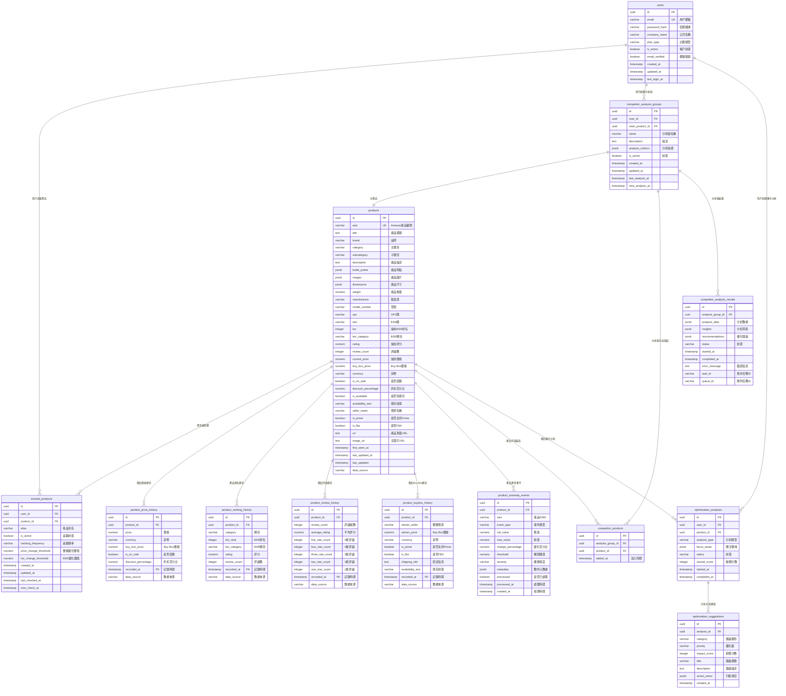
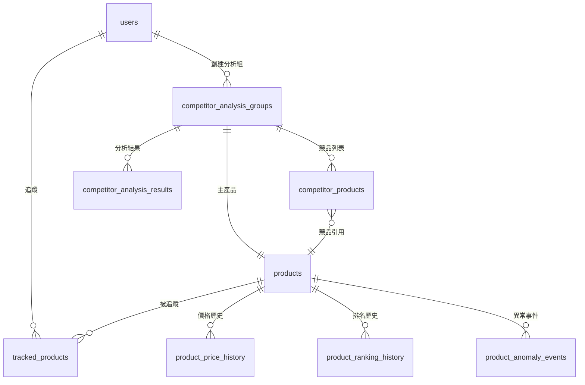
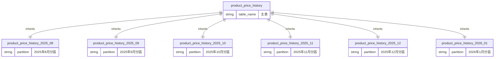

# 資料庫設計文件

## 概述

本文件描述 Amazon 賣家產品監控與優化工具的資料庫架構設計，包含資料模型、表結構、索引策略和優化方案。

## 資料庫架構

### 技術選型

**主資料庫**: PostgreSQL 15
- 關聯式資料庫，支持 ACID 事務
- JSON/JSONB 支持，適合半結構化資料
- 強大的索引和查詢優化能力
- 成熟的生態系統和工具支持

**快取資料庫**: Redis 7
- 高效能記憶體快取
- 支持多種資料結構
- 作為消息佇列和任務調度

### 資料庫命名規範

- 表名: 小寫蛇形命名，使用複數形式
- 欄位: 小寫蛇形命名
- 主鍵: `id` 或 `{table}_id`
- 外鍵: `{referenced_table}_id`
- 索引: `idx_{table}_{columns}`
- 約束: `{table}_{constraint_type}_{columns}`

## 🎨 ERD 實體關聯圖

### 完整 ERD 圖

### 核心模組關聯圖

### 分區表結構圖

## 核心資料模型

### 用戶管理模組

#### users 表 (用戶基本資訊)
- `id` (UUID): 主鍵，自動生成
- `email` (VARCHAR): 唯一索引，用戶登入憑證
- `password_hash` (VARCHAR): bcrypt 加密密碼
- `company_name` (VARCHAR): 公司名稱
- `plan_type` (VARCHAR): 計劃類型，默認 'basic'
- `is_active` (BOOLEAN): 帳戶狀態，默認 true
- `email_verified` (BOOLEAN): 郵箱驗證狀態，默認 false
- `created_at` (TIMESTAMP): 註冊時間，自動設置
- `updated_at` (TIMESTAMP): 更新時間，自動更新
- `last_login_at` (TIMESTAMP): 最後登入時間

### 產品追蹤模組

#### products 表 (產品主資料)
- `id` (UUID): 主鍵，自動生成
- `asin` (VARCHAR): Amazon 產品編號，10位字符，唯一索引
- `title` (TEXT): 產品標題
- `brand` (VARCHAR): 品牌
- `category` (VARCHAR): 主類目
- `subcategory` (VARCHAR): 子類目
- `description` (TEXT): 產品描述
- `bullet_points` (JSONB): 產品特點列表
- `images` (JSONB): 產品圖片URL列表
- `dimensions` (JSONB): 產品尺寸信息
- `weight` (NUMERIC): 產品重量
- `manufacturer` (VARCHAR): 製造商
- `model_number` (VARCHAR): 型號
- `upc` (VARCHAR): UPC碼
- `ean` (VARCHAR): EAN碼
- `bsr` (INTEGER): 當前 BSR 排名
- `bsr_category` (VARCHAR): BSR 類目
- `rating` (NUMERIC): 當前評分
- `review_count` (INTEGER): 評論數，默認 0
- `current_price` (NUMERIC): 當前價格
- `buy_box_price` (NUMERIC): Buy Box 價格
- `currency` (VARCHAR): 貨幣，默認 'USD'
- `is_on_sale` (BOOLEAN): 是否促銷，默認 false
- `discount_percentage` (NUMERIC): 折扣百分比
- `is_available` (BOOLEAN): 是否有庫存，默認 true
- `availability_text` (VARCHAR): 庫存狀態文本
- `seller_name` (VARCHAR): 賣家名稱
- `is_prime` (BOOLEAN): 是否支持 Prime，默認 false
- `is_fba` (BOOLEAN): 是否 FBA，默認 false
- `url` (TEXT): 產品頁面URL
- `image_url` (TEXT): 主圖片URL
- `first_seen_at` (TIMESTAMP): 首次發現時間
- `last_updated_at` (TIMESTAMP): 最後更新時間
- `last_updated` (TIMESTAMP): 最後更新時間（兼容欄位）
- `data_source` (VARCHAR): 數據來源，默認 'apify'

#### tracked_products 表 (用戶追蹤設定)
- `id` (UUID): 主鍵，自動生成
- `user_id` (UUID): 外鍵 -> users.id
- `product_id` (UUID): 外鍵 -> products.id
- `alias` (VARCHAR): 產品別名
- `is_active` (BOOLEAN): 追蹤狀態，默認 true
- `tracking_frequency` (VARCHAR): 追蹤頻率，'hourly'/'daily'/'weekly'，默認 'daily'
- `price_change_threshold` (NUMERIC): 價格變化閾值百分比，默認 10.0，範圍 0-100
- `bsr_change_threshold` (NUMERIC): BSR變化閾值百分比，默認 30.0，範圍 0-100
- `created_at` (TIMESTAMP): 開始追蹤時間
- `updated_at` (TIMESTAMP): 更新時間
- `last_checked_at` (TIMESTAMP): 最後檢查時間
- `next_check_at` (TIMESTAMP): 下次檢查時間

#### product_price_history 表 (價格歷史) - 按月分區
- `id` (UUID): 主鍵，自動生成
- `product_id` (UUID): 外鍵 -> products.id
- `price` (NUMERIC): 價格，必填
- `currency` (VARCHAR): 貨幣，默認 'USD'
- `buy_box_price` (NUMERIC): Buy Box 價格
- `is_on_sale` (BOOLEAN): 是否促銷，默認 false
- `discount_percentage` (NUMERIC): 折扣百分比
- `recorded_at` (TIMESTAMP): 記錄時間，主鍵之一
- `data_source` (VARCHAR): 數據來源，默認 'apify'
- **分區策略**: 按月分區 (YYYY_MM)，支持 2025-08 到 2026-08
- **複合主鍵**: (id, recorded_at)

#### product_ranking_history 表 (BSR 和評分歷史) - 按月分區
- `id` (UUID): 主鍵，自動生成
- `product_id` (UUID): 外鍵 -> products.id
- `category` (VARCHAR): 類目，必填
- `bsr_rank` (INTEGER): BSR 排名
- `bsr_category` (VARCHAR): BSR 類目
- `rating` (NUMERIC): 評分
- `review_count` (INTEGER): 評論數，默認 0
- `recorded_at` (TIMESTAMP): 記錄時間，主鍵之一
- `data_source` (VARCHAR): 數據來源，默認 'apify'
- **分區策略**: 按月分區 (YYYY_MM)，支持 2025-08 到 2026-08
- **複合主鍵**: (id, recorded_at)

#### product_review_history 表 (評論變化追蹤) - 按月分區
- `id` (UUID): 主鍵，自動生成
- `product_id` (UUID): 外鍵 -> products.id
- `review_count` (INTEGER): 評論總數，默認 0
- `average_rating` (NUMERIC): 平均評分，範圍 0-5
- `five_star_count` (INTEGER): 5星評論數，默認 0
- `four_star_count` (INTEGER): 4星評論數，默認 0
- `three_star_count` (INTEGER): 3星評論數，默認 0
- `two_star_count` (INTEGER): 2星評論數，默認 0
- `one_star_count` (INTEGER): 1星評論數，默認 0
- `recorded_at` (TIMESTAMP): 記錄時間，主鍵之一
- `data_source` (VARCHAR): 數據來源，默認 'apify'
- **分區策略**: 按月分區 (YYYY_MM)，支持 2025-08 到 2026-08
- **複合主鍵**: (id, recorded_at)
- **約束**: average_rating >= 0 AND average_rating <= 5

#### product_buybox_history 表 (Buy Box 變化) - 按月分區
- `id` (UUID): 主鍵，自動生成
- `product_id` (UUID): 外鍵 -> products.id
- `winner_seller` (VARCHAR): 獲勝賣家名稱
- `winner_price` (NUMERIC): Buy Box 價格，必須 >= 0
- `currency` (VARCHAR): 貨幣，默認 'USD'
- `is_prime` (BOOLEAN): 是否支持 Prime，默認 false
- `is_fba` (BOOLEAN): 是否 FBA，默認 false
- `shipping_info` (TEXT): 配送信息
- `availability_text` (VARCHAR): 庫存狀態
- `recorded_at` (TIMESTAMP): 記錄時間，主鍵之一
- `data_source` (VARCHAR): 數據來源，默認 'apify'
- **分區策略**: 按月分區 (YYYY_MM)，支持 2025-08 到 2026-08
- **複合主鍵**: (id, recorded_at)
- **約束**: winner_price IS NULL OR winner_price >= 0

#### product_anomaly_events 表 (異常事件)
- `id` (UUID): 主鍵，自動生成
- `product_id` (UUID): 外鍵 -> products.id
- `asin` (VARCHAR): 產品ASIN，必填
- `event_type` (VARCHAR): 事件類型，必填
- `old_value` (NUMERIC): 舊值
- `new_value` (NUMERIC): 新值
- `change_percentage` (NUMERIC): 變化百分比
- `threshold` (NUMERIC): 觸發閾值
- `severity` (VARCHAR): 嚴重程度，默認 'info'
- `metadata` (JSONB): 額外元數據
- `processed` (BOOLEAN): 是否已處理，默認 false
- `processed_at` (TIMESTAMP): 處理時間
- `created_at` (TIMESTAMP): 檢測時間，必填

### 競品分析模組

#### competitor_analysis_groups 表 (分析組)
- `id` (UUID): 主鍵，自動生成
- `user_id` (UUID): 外鍵 -> users.id
- `main_product_id` (UUID): 外鍵 -> products.id
- `name` (VARCHAR): 分析組名稱，必填
- `description` (TEXT): 描述
- `analysis_metrics` (JSONB): 分析指標，默認 ["price", "bsr", "rating", "features"]
- `is_active` (BOOLEAN): 狀態，默認 true
- `created_at` (TIMESTAMP): 建立時間
- `updated_at` (TIMESTAMP): 更新時間
- `last_analysis_at` (TIMESTAMP): 最後分析時間
- `next_analysis_at` (TIMESTAMP): 下次分析時間

#### competitor_products 表 (競品關聯)
- `id` (UUID): 主鍵
- `analysis_group_id` (UUID): 外鍵 -> competitor_analysis_groups.id
- `product_id` (UUID): 外鍵 -> products.id
- `added_at` (TIMESTAMP): 加入時間
- 唯一約束: `(analysis_group_id, product_id)`

#### competitor_analysis_results 表 (分析結果)
- `id` (UUID): 主鍵，自動生成
- `analysis_group_id` (UUID): 外鍵 -> competitor_analysis_groups.id
- `analysis_data` (JSONB): 多維度分析數據（可為空）
- `insights` (JSONB): 分析洞察
- `recommendations` (JSONB): 優化建議
- `status` (VARCHAR): 狀態，默認 'pending'，可選值: pending/queued/processing/completed/failed
- `started_at` (TIMESTAMP): 開始時間
- `completed_at` (TIMESTAMP): 完成時間
- `error_message` (TEXT): 錯誤信息
- `task_id` (VARCHAR): 異步任務ID
- `queue_id` (VARCHAR): 隊列任務ID

### 優化建議模組

#### optimization_analyses 表 (優化分析)
- `id` (UUID): 主鍵，自動生成
- `user_id` (UUID): 外鍵 -> users.id
- `product_id` (UUID): 外鍵 -> products.id
- `analysis_type` (VARCHAR): 分析類型，默認 'comprehensive'
- `focus_areas` (JSONB): 關注領域，默認 ["title", "pricing", "description", "images", "keywords"]
- `status` (VARCHAR): 狀態，默認 'pending'
- `overall_score` (INTEGER): 總體分數
- `started_at` (TIMESTAMP): 開始時間
- `completed_at` (TIMESTAMP): 完成時間

#### optimization_suggestions 表 (優化建議)
- `id` (UUID): 主鍵，自動生成
- `analysis_id` (UUID): 外鍵 -> optimization_analyses.id
- `category` (VARCHAR): 建議類別，必填
- `priority` (VARCHAR): 優先級，必填
- `impact_score` (INTEGER): 影響分數，必填
- `title` (VARCHAR): 建議標題，必填
- `description` (TEXT): 建議描述，必填
- `action_items` (JSONB): 行動項目
- `created_at` (TIMESTAMP): 創建時間

### 通知管理模組

**注意**: 通知管理相關表格在當前數據庫結構中尚未實現，建議未來版本添加：

#### notifications 表 (通知記錄) - 待實現
- `id` (UUID): 主鍵
- `user_id` (UUID): 外鍵 -> users.id
- `type` (VARCHAR): 通知類型
- `title` (VARCHAR): 標題
- `message` (TEXT): 內容
- `data` (JSONB): 相關數據
- `is_read` (BOOLEAN): 是否已讀
- `created_at` (TIMESTAMP): 建立時間

#### notification_preferences 表 (通知偏好) - 待實現
- `id` (UUID): 主鍵
- `user_id` (UUID): 外鍵 -> users.id
- `email_enabled` (BOOLEAN): Email 通知
- `push_enabled` (BOOLEAN): 推送通知
- `notification_types` (JSONB): 啟用的通知類型
- `updated_at` (TIMESTAMP): 更新時間

## 索引策略

### 主鍵索引
所有表的 `id` 欄位自動建立主鍵索引

### 唯一索引
- `users.email` - 確保郵箱唯一性
- `products.asin` - 確保ASIN唯一性（10位字符長度約束）
- **注意**: tracked_products 和 competitor_products 未設置複合唯一索引

### 建議索引（需要手動創建）
- `idx_tracked_products_user_active`: (user_id, is_active) - 查詢用戶活躍追蹤
- `idx_price_history_product_time`: (product_id, recorded_at DESC) - 價格歷史查詢
- `idx_ranking_history_product_time`: (product_id, recorded_at DESC) - 排名歷史查詢
- `idx_review_history_product_time`: (product_id, recorded_at DESC) - 評論歷史查詢
- `idx_buybox_history_product_time`: (product_id, recorded_at DESC) - Buy Box歷史查詢
- `idx_anomaly_events_product_time`: (product_id, created_at DESC) - 異常事件查詢
- `idx_competitor_analysis_results_task_id`: (task_id) - 異步任務查詢（已創建）

### 部分索引
- `idx_products_active_bsr`: (current_bsr) WHERE is_active = true
- `idx_anomaly_events_unnotified`: (product_id) WHERE is_notified = false

## 效能優化

### 分區策略

#### 已實現的月度分區表
以下表已按月分區實現，格式為 `table_name_YYYY_MM`:

**product_price_history 分區**:
- `product_price_history_2025_08` 到 `product_price_history_2026_08`
- 複合主鍵: (id, recorded_at)

**product_ranking_history 分區**:
- `product_ranking_history_2025_08` 到 `product_ranking_history_2026_08`
- 複合主鍵: (id, recorded_at)

**product_review_history 分區**:
- `product_review_history_2025_08` 到 `product_review_history_2026_08`
- 複合主鍵: (id, recorded_at)

**product_buybox_history 分區**:
- `product_buybox_history_2025_08` 到 `product_buybox_history_2026_08`
- 複合主鍵: (id, recorded_at)

**分區優勢**:
- 查詢效能大幅提升（按時間範圍查詢）
- 便於數據歸檔和清理
- 降低表鎖定影響
- 支持並行維護操作

### 查詢優化

#### 物化視圖
為複雜的統計查詢建立物化視圖:
- 產品每日統計
- 用戶活躍度統計
- 異常事件彙總

#### 查詢快取
使用 Redis 快取高頻查詢:
- 熱門產品資料
- 用戶追蹤列表
- 最近的分析結果

### 資料庫連接池

連接池配置:
- 最大連接數: 100
- 最小空閒連接: 10
- 連接超時: 30秒
- 空閒超時: 10分鐘

## 資料安全

### 敏感資料保護

#### 加密存儲
- 密碼: bcrypt 雜湊
- Token: SHA-256 雜湊
- API 密鑰: AES-256 加密

#### 資料脫敏
- 日誌中不記錄敏感資料
- API 回應中隱藏部分資訊
- 備份檔案加密存儲

### 訪問控制

#### 行級安全 (RLS)
啟用 PostgreSQL 行級安全:
- 用戶只能訪問自己的數據
- 管理員可以訪問所有數據

#### 審計日誌
記錄所有敏感操作:
- 用戶登入/登出
- 數據修改
- 權限變更

## 備份與恢復

### 備份策略

#### 全量備份
- 頻率: 每日凌晨 2:00
- 保留: 30 天
- 存儲: 異地備份

#### 增量備份
- 頻率: 每小時
- 保留: 7 天
- WAL 歸檔

### 恢復機制

#### 時間點恢復 (PITR)
- 支持恢復到任意時間點
- RPO: < 1 小時
- RTO: < 2 小時

#### 災難恢復
- 主從複製
- 自動故障轉移
- 跨區域備份

## 監控與維護

### 效能監控

#### 關鍵指標
- 查詢響應時間
- 事務處理量
- 連接池使用率
- 快取命中率

#### 慢查詢日誌
記錄超過 100ms 的查詢:
- 查詢語句
- 執行時間
- 執行計畫
- 資源消耗

### 維護作業

#### 定期維護
- VACUUM: 每週
- ANALYZE: 每日
- REINDEX: 每月
- 清理過期數據: 每月

#### 健康檢查
- 表膨脹檢查
- 索引效率分析
- 鎖衝突檢測
- 連接數監控

## 擴展性考慮

### 垂直擴展
- 增加 CPU 和記憶體
- SSD 存儲優化
- 連接池調整

### 水平擴展
- 讀寫分離
- 分片策略
- 多主複製

### 數據歸檔
- 超過 1 年的歷史數據歸檔
- 使用專門的歷史數據庫
- 壓縮存儲節省空間